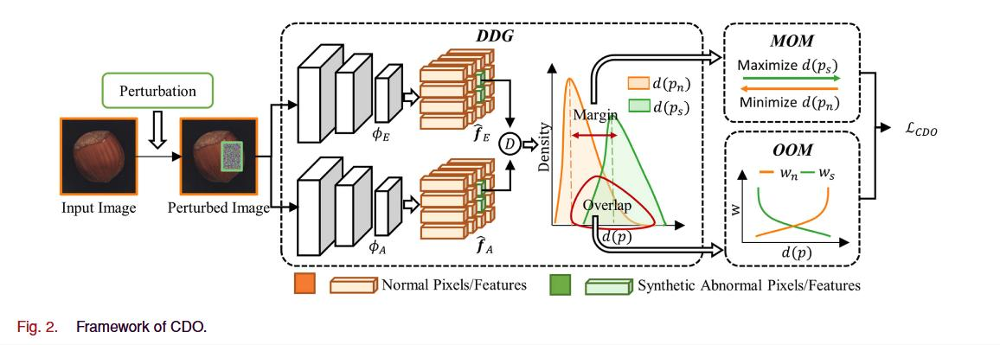
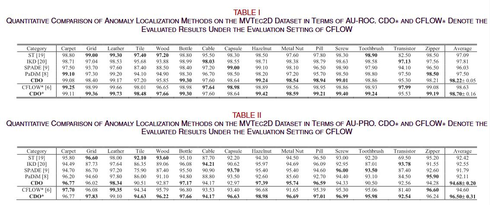

[](https://paperswithcode.com/sota/anomaly-detection-on-mvtec-ad?p=collaborative-discrepancy-optimization-for)
[](https://paperswithcode.com/sota/anomaly-detection-on-mvtec-3d-ad-1?p=collaborative-discrepancy-optimization-for)
## Collaborative Discrepancy Optimization for Reliable Image Anomaly Localization
[IEEE Transactions on Industrial Informatics 2023](https://ieeexplore.ieee.org/document/10034849)

## Abstract
Most unsupervised image anomaly localization methods suffer from overgeneralization because of the high generalization abilities of convolutional neural networks, leading to unreliable predictions. To mitigate the overgeneralization, this study proposes to collaboratively optimize normal and abnormal feature distributions with the assistance of synthetic anomalies, namely collaborative discrepancy optimization (CDO). CDO introduces a margin optimization module and an overlap optimization module to optimize the two key factors determining the localization performance, i.e. , the margin and the overlap between the discrepancy distributions (DDs) of normal and abnormal samples. With CDO, a large margin and a small overlap between normal and abnormal DDs are obtained, and the prediction reliability is boosted. Experiments on MVTec2D and MVTec3D show that CDO effectively mitigates the overgeneralization and achieves great anomaly localization performance with real-time computation efficiency. A real-world automotive plastic parts inspection application further demonstrates the capability of the proposed CDO.
## BibTex Citation
If you like our [paper](https://ieeexplore.ieee.org/document/10034849) or code, please use the following BibTex:
```
@ARTICLE{10034849,
  author={Cao, Yunkang and Xu, Xiaohao and Liu, Zhaoge and Shen, Weiming},
  journal={IEEE Transactions on Industrial Informatics}, 
  title={Collaborative Discrepancy Optimization for Reliable Image Anomaly Localization}, 
  year={2023},
  volume={},
  number={},
  pages={1-10},
  doi={10.1109/TII.2023.3241579}}

```

## Installation
- Clone this repository: tested on Python 3.7
- Install [PyTorch](http://pytorch.org/): tested on v1.7


## Datasets
We support [MVTec AD dataset](https://www.mvtec.com/de/unternehmen/forschung/datasets/mvtec-ad/) 
and [MVTec3D AD dataset](https://www.mvtec.com/company/research/datasets/mvtec-3d-ad) 
for anomaly localization in factory setting.

## Training Models
- Run code by selecting device, dataset, category, model (backbone, wi/o MOM and OOM), etc.
```
python train.py --gpu-id 0 --dataset mvtec2d --class-name carpet --backbone hrnet32 --MOM True --OOM True --gamma 2.
```


## CDO Architecture


## Reference CDO Quantitative Results 


## Reference CDO Qualitative Results 
